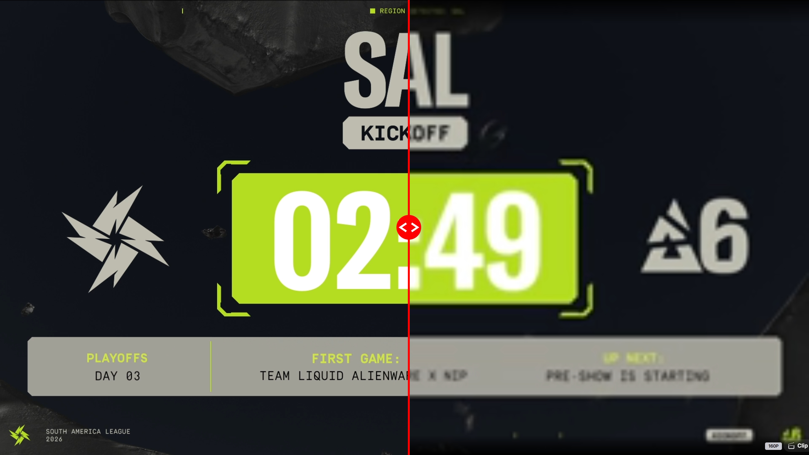
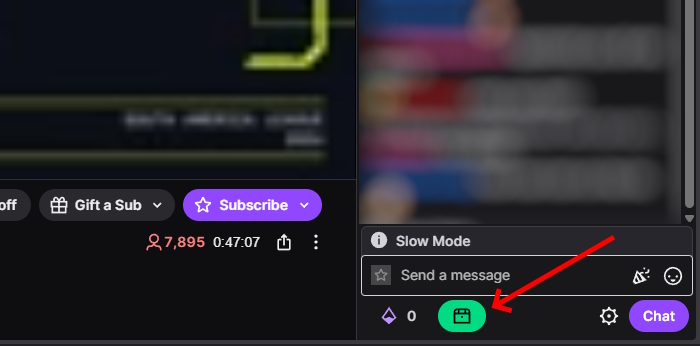
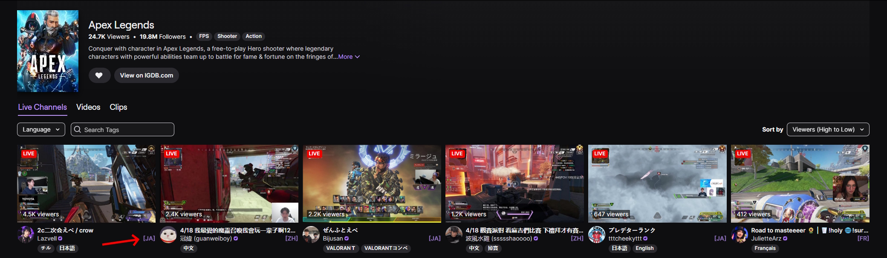
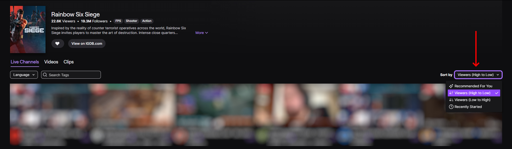

<h1 align="center">
Twitch Enhancer
</h1>

Modular browser extension for Twitch that combines several quality-of-life improvements in one place. Designed as a unified replacement for multiple separate Twitch userscripts, it offers shared settings, per-module toggles, and separate builds for **Chrome/Chromium** and **Firefox**.

It currently includes [**Toggle Video Quality**](https://github.com/Vikindor/twitch-toggle-video-quality), [**Force Sort Viewers High to Low**](https://github.com/Vikindor/twitch-force-sort-viewers), [**Show Stream Language**](https://github.com/Vikindor/twitch-show-stream-language), [**Keep Tab Active**](https://github.com/Vikindor/twitch-keep-tab-active), and the new **Auto Claim Channel Points** feature.

Especially useful for people who like to **keep streams running in the background** to support streamers, farm **channel points**, or keep streams running for **Drops** with less manual babysitting.

> ⚠️ This extension does not block ads and does not attempt to bypass Twitch ad delivery

## ✨ Features

### Toggle Video Quality



- Main action-button feature
- Switches between low and preferred high quality
- Supports tab mute or player mute
- Can restore both tab and player audio when returning to high quality

### Auto Claim Bonus



- Polls for the `Claim Bonus` button under the chat
- Claims channel points bonuses automatically

### Keep Tab Active

- Experimental module
- Multiple strategies to keep streams alive in the background
- Can dismiss Twitch overlays such as `Start Watching` and network errors
- Can request a screen wake lock when supported

### Show Stream Language



- Displays the stream language like `[EN]` / `[JA]` / etc.
- Two visual modes: a badge on the preview card or a suffix next to the streamer's username

### Force Sort Viewers



- Nudges Twitch directory pages toward `Viewers: High to Low` sorting
- Supports per-load and per-tab-session run policies

## 🚀 Installation

### Option 1: Install from the store

(Coming soon)

### Option 2: Load the unpacked extension

First, build the project.

Just run:

```
RUN_build.bat
```

Or through the console:

```powershell
node .\build.js
```

#### Chrome / Brave / Edge

1. Open `chrome://extensions`
2. Enable **Developer mode**
3. Click **Load unpacked**
4. Select `builds\chrome`

#### Firefox

1. Open `about:debugging#/runtime/this-firefox`
2. Click **Load Temporary Add-on**
3. Select `builds\firefox\manifest.json`

## ⚠️ Notes & Limitations

- This extension does not block ads and does not attempt to bypass Twitch ad delivery.
- The extension action button currently triggers `Toggle Video Quality` specifically.
- `Keep Tab Active` may behave differently across browsers or Twitch updates.
- Browser throttling with a large number of open tabs is controlled by the browser itself, and the extension cannot override it.
- If you run into throttling-related playback issues, using tab mute is generally more reliable than muting the Twitch player directly.
